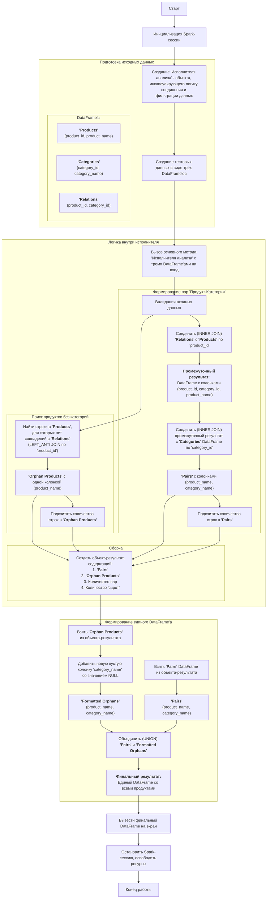

# PySpark Product-Category Analysis

Проект для анализа связей между продуктами и категориями с использованием PySpark.

## Описание

Приложение решает задачу получения:

- Всех пар «Имя продукта - Имя категории»
- Всех продуктов, у которых нет категорий
- Объединенного результата в одном DataFrame

## Особенности реализации

- **ООП подход**: Использование классов, интерфейсов и наследования
- **Паттерны проектирования**: Singleton (SparkService), Factory (AnalyzerFactory)
- **Типизация**: Полная аннотация типов с использованием typing
- **Логгирование**: Структурированное логгирование на английском языке
- **Валидация**: Проверка входных данных
- **Тестирование**: Полное покрытие unit-тестами
- **Документация**: Подробные docstring для всех модулей и функций

## Структура проекта

```
├── src/
│   ├── __init__.py
│   ├── analyzers/
│   │   └── product_category_analyzer.py    # Основная логика анализа
│   ├── config/
│   │   └── logging_config.py               # Конфигурация логгирования
│   ├── exceptions/
│   │   └── custom_exceptions.py            # Пользовательские исключения
│   ├── factories/
│   │   └── analyzer_factory.py             # Фабрика для создания анализаторов
│   ├── interfaces/
│   │   └── analyzer_interface.py           # Интерфейсы
│   ├── models/
│   │   └── data_models.py                  # Модели данных
│   ├── services/
│   │   └── spark_service.py                # Сервис для работы с Spark
│   └── validators/
│       └── dataframe_validator.py          # Проверка данных
├── tests/
│   ├── conftest.py                         # Конфигурация pytest
│   ├── test_analyzers/
│   ├── test_factories/
│   ├── test_models/
│   ├── test_services/
│   └── test_validators/
├── main.py                                 # Точка входа в приложение
├── requirements.txt                        # Зависимости
├── setup.py                               # Настройка пакета
├── Makefile                               # Команды для разработки
└── README.md
```

## Установка и запуск

### Требования

- Python 3.8+
- Java 17+ (для Spark)

### Установка зависимостей

```bash
make install
# или
pip install -e .[dev]
```

### Установка Java

1. Скачайте и установите [Java JDK](https://adoptopenjdk.net/) (рекомендуется JDK 17+).
2. Убедитесь, что переменная окружения JAVA_HOME добавлена (путь к вашей папке JDK).
3. Проверьте установку

```bash
java -version
echo %JAVA_HOME%
```

### Подготовка к запуску на Windows

1. Указать Spark, какой Python использовать.
   Для этого необходимо установить переменную окружения PYSPARK_PYTHON. (Уже выполнено в main.py)
    ```bash
      os.environ['PYSPARK_PYTHON'] = sys.executable
      os.environ['PYSPARK_DRIVER_PYTHON'] = sys.executable
    ```
2. Установить winutils.exe:
    - Найти сборку, которая соответствует версии Hadoop, с которой собран Spark. В main есть вывод версий Spark и Hadoop.
       ```bash
          2025-06-15 17:09:05,890 - SparkService - INFO - PySpark Version: 4.0.0
          2025-06-15 17:09:05,895 - SparkService - INFO - Hadoop Version: 3.4.1
       ```
    - Cборку можно скачать здесь: https://github.com/cdarlint/winutils. Перейти в папку,
      соответствующую версии Hadoop (например, hadoop-3.3.6), → bin и скачать файл winutils.exe и hadoop.dll.
    - Создать папку. Например, C:\hadoop\bin. Переместить скачанные файлы (winutils.exe, hadoop.dll) в эту папку.
    - Установить переменные окружения в Windows: 
      - HADOOP_HOME=C:\hadoop (путь к папке, где лежит папка bin)
      - Path добавить новый путь: %HADOOP_HOME%\bin.
    - Перезапустить ПК.

### Запуск приложения

```bash
make run
# или
python main.py
```

### Запуск тестов

```bash
make test
# или
pytest tests/ -v --cov=src
```
Причина, по которой тесты могут долго выполняться, заключается в том, что они запускают полноценную Spark сессию. 
Это необходимо для проверки корректности работы с данными.
Создание Spark сессии: сессия создаётся 1 раз на всю тестовую сессию, но при выполнении запускается 
Java Virtual Machine (JVM), инициализируется Spark Context, создается Spark сессия, выделяется память и ресурсы. 
Это самая долгая операция, она может занимать 5-10 секунд.

## Использование

### Основной класс анализатора

```python
from src.factories.analyzer_factory import AnalyzerFactory

# Создание анализатора
analyzer = AnalyzerFactory.create_product_category_analyzer()

# Анализ данных
result = analyzer.analyze_product_categories(
    products_df, categories_df, relations_df
)

# Получение объединенного результата
unified_df = analyzer.get_unified_result(
    products_df, categories_df, relations_df
)
```

### Формат входных данных

#### Products DataFrame

| product_id | product_name |
|------------|--------------|
| 1          | iPhone 14    |
| 2          | MacBook Pro  |

#### Categories DataFrame

| category_id | category_name |
|-------------|---------------|
| 1           | Smartphones   |
| 2           | Laptops       |

#### Product-Category Relations DataFrame

| product_id | category_id |
|------------|-------------|
| 1          | 1           |
| 2          | 2           |

### Формат выходных данных

#### Результат анализа

```python
ProductCategoryResult(
    product_category_pairs=DataFrame,  # Пары продукт-категория
    products_without_categories=DataFrame,  # Продукты без категорий
    total_pairs=int,  # Количество пар
    total_products_without_categories=int  # Количество продуктов без категорий
)
```

#### Объединенный DataFrame

| product_name   | category_name |
|----------------|---------------|
| iPhone 14      | Smartphones   |
| MacBook Pro    | Laptops       |
| Orphan Product | null          |

## Команды разработки

```bash
make install        # Установка зависимостей
make test          # Запуск тестов
make test-coverage # Тесты с покрытием
make lint          # Линтинг кода
make format        # Форматирование кода
make clean         # Очистка временных файлов
make run           # Запуск приложения
make quality-check # Проверка качества кода
make build         # Сборка пакета
```

## Архитектура

### Блок-схема

### Паттерны проектирования

1. **Singleton** - `SparkService` для управления единственной Spark сессией
2. **Factory** - `AnalyzerFactory` для создания анализаторов
3. **Strategy** - Интерфейс `IProductCategoryAnalyzer` для различных стратегий анализа

### Принципы SOLID

- **SRP**: Каждый класс имеет одну ответственность
- **OCP**: Расширение через интерфейсы без изменения существующего кода
- **LSP**: Классы-наследники взаимозаменяемы
- **ISP**: Интерфейсы разделены по функциональности
- **DIP**: Зависимость от абстракций, а не от конкретных реализаций

## Логгирование

Все логи ведутся на английском языке с указанием:

- Временной метки
- Имени класса/модуля
- Уровня логгирования
- Сообщения

Пример:

```
2024-01-15 10:30:45,123 - ProductCategoryAnalyzer - INFO - Starting product-category analysis
```

## Тестирование

Проект включает полное покрытие unit-тестами:

- Тесты анализаторов
- Тесты валидаторов
- Тесты сервисов
- Тесты фабрик
- Тесты моделей данных

## Лицензия

MIT License

# Авторы

[Nadezhda Shiryaeva] - [sns0898@mail.ru] - [https://github.com/DalekTek]